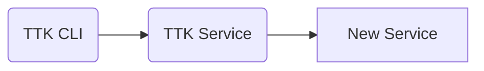

# typescript-svc-template

## Contributing

Refer to [CONTRIBUTING.md](./CONTRIBUTING.md) for information on how to contribute, committing changes, releases and snapshots.

## Configuration

This service uses [Convict](https://github.com/mozilla/node-convict/blob/master/packages/convic) library for managing configuration. Using `Convict`, we can specify the configuration using `json` files and through the environment variable.

The precedence order is explained in this [section](https://github.com/mozilla/node-convict/blob/master/packages/convict/README.md#precedence-order).

You can have a look at the environment variables in the `config` folder.

Here are the options that can be configured through environment variables.
| Environment variable | Description | Example values | Default value |
| -------------------- | ----------- | ----------- | ------ |
| PORT | The port of the API server | 0 to 65535 | 8000 |
MOCK_SERVICE_HOST | The Hostname/IP address of mock service | | mock-service-host |
MOCK_SERVICE_PORT | The port of mock service | 0 to 65535 | 3001 |
GET_DATA_FROM_MOCK_SERVICE | Whether to connect to mock service and get the sample data | true,false | false |

## Pre-requisites

### NPM Registry Configuration

ModusBox libraries are officially hosted on Github: https://github.com/orgs/modusbox/packages

To correctly resolve `@modusbox/*` specific libraries, one needs to add the below entry in an [.npmrc](./.npmrc) file in your NodeJS's project root folder.

```file
@modusbox:registry=https://npm.pkg.github.com
```

This will allow `npm install` to correctly fetch dependencies from [ModusBox's NPM registry hosted on GitHub](https://github.com/orgs/modusbox/packages).

If the [.npmrc](./.npmrc) is not configured as such, the `@modusbox/*` dependencies will be pulled from the standard NPM registries.

### Install

Command to install dependencies:

```bash
npm install
```

## Build

Command to transpile Typescript into JS:

```bash
npm run build
```

Command to LIVE transpile Typescript into JS live when any changes are made to the code-base:

```bash
npm run watch
```

## Run

```bash
npm start
```

## Test

```bash
npm test
```

## Functional Testing using Mojaloop Testing Toolkit (TTK)

We can use TTK to perform functional tests on a new JSON based RestAPI service.



In this case, we need to run the new service with all its dependencies and execute TTK tests against it.

### Running functional tests

An example structure of the TTK files are provided in the directory `test/func`. Using docker-compose.yaml file provided in the folder, we can start the required services and execute the tests automatically.

Use the following command to execute sample functional tests against the example api service.

```
npm run test:func
```

You should see the `Passed percentage` as  `100%`


TODO: Choose one swagger UI and remove the other. https://github.com/stoplightio/elements