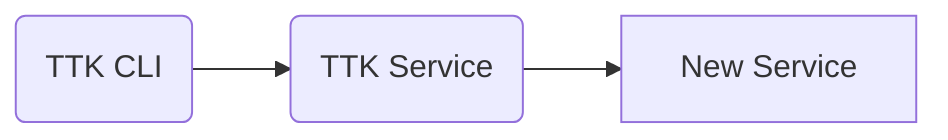

# typescript-svc-template

## Contributing

Refer to [CONTRIBUTING.md](./CONTRIBUTING.md) for information on how to contribute, committing changes, releases and snapshots.

## Configuration

Here are the options that can be configured through environment variables.

| Environment variable | Description | Example values |
| -------------------- | ----------- | ------ |
| ...   | ... | ... |

## Pre-requisites

### NPM Registry Configuration

ModusBox libraries are officially hosted on Github: https://github.com/orgs/modusbox/packages

To correctly resolve `@modusbox/*` specific libraries, one needs to add the below entry in an [.npmrc](./.npmrc) file in your NodeJS's project root folder.

```file
@modusbox:registry=https://npm.pkg.github.com
```

This will allow `npm install` to correctly fetch dependencies from [ModusBox's NPM registry hosted on GitHub](https://github.com/orgs/modusbox/packages).

If the [.npmrc](./.npmrc) is not configured as such, the `@modusbox/*` dependencies will be pulled from the standard NPM registries.

### Install

Command to install dependencies:

```bash
npm install
```

## Build

Command to transpile Typescript into JS:

```bash
npm run build
```

Command to LIVE transpile Typescript into JS live when any changes are made to the code-base:

```bash
npm run watch
```

## Run

```bash
npm start
```

## Test

```bash
npm test
```

## Functional Testing using Mojaloop Testing Toolkit (TTK)

We can use TTK to perform functional tests on a new JSON based RestAPI service.



In this case, we need to run the new service with all its dependencies and execute TTK tests against it.

### Running functional tests

An example structure of the TTK files are provided in the directory `test/func`

- Include the openapi specification of the new service in TTK
  - Create a directory `Ex: new-dev-service` in the folder `spec_files/api_definitions` and place the new API definition in `api_spec.yaml`
  - In `system_config.json`, add it to the parameter `API_DEFINITIONS`
  - Remove the unnecessary API definitions from `spec_files/api_definitions` and `system_config.json`
- Configure TTK
  - Set the parameter `CALLBACK_ENDPOINT` in `user_config.json` to point to proper hostname and port of the new service.
- Run the new service and its dependencies in the background
- Run TTK service in the background
- Prepare a test case to test the required endpoints of the new service
- If you want to parameterize some values, prepare a TTK environment file
- Run the test case file with TTK CLI using the environment file

  There is an example docker-compose.yaml file provided in the directory `test/func`. Using this file, we can start the required services and execute the tests automatically.
  Use the following command to execute sample functional tests against the example api service.
  ```
  npm run test:func
  ```
  You should see the `Passed percentage` as  `100%`

TODO:
- Add documentation about config using `convict` lib

- For Swagger UI https://github.com/stoplightio/elements
TODO: Choose one swagger UI and remove the other.