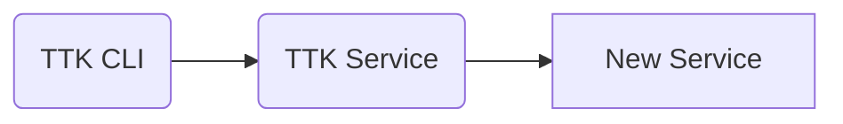
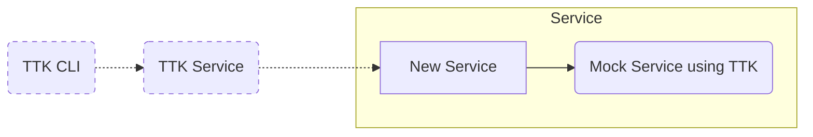

# Using TTK in various scenarios

## Scenario 1 (TTK Functional Tests)

We can use TTK to perform functional tests on a new JSON based RestAPI service.

In this case, we need to run the new service with all its dependencies and execute TTK tests against it.
The following are the steps:
- Include the openapi specification of the new service in TTK
  - Create a directory `Ex: new-dev-service` in the folder `spec_files/api_definitions` and place the new API definition in `api_spec.yaml`
  - In `system_config.json`, add it to the parameter `API_DEFINITIONS`
  - Remove the unneccessary API definitions from `spec_files/api_definitions` and `system_config.json`
- Configure TTK
  - Set the parameter `CALLBACK_ENDPOINT` in `user_config.json` to point to proper hostname and port of the new service.
- Run the new service and its dependencies in the background
- Run TTK service in the background
- Prepare a test case to test the required endpoints of the new service
- If you want to parameterise some values, prepare a TTK environment file
- Run the test case file with TTK CLI using the environment file

## Scenario 2 (Mocking a service for development / for integration and functional tests)

We can use TTK to mock a dependent service (JSON RestAPI) to use with the developing service.

If a dependent service is still under development or too big to be run in the test harness, we can use TTK to mock that service. Please follow this documentation to create rules in TTK to get intended responses / callbacks from the mocked service.

In this case, its preferable to run two separate TTK services. One for mocking and one for functional tests.