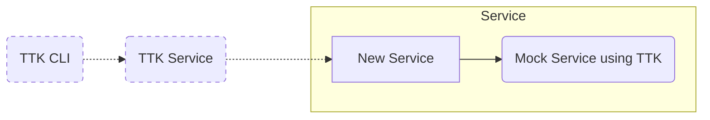

## Mocking a service for development / for integration and functional tests

We can use TTK to mock a dependent service (JSON RestAPI) to use with the developing service.

If a dependent service is still under development or too big to be run in the test harness, we can use TTK to mock that service. Please use the example template for TTK configuration files provided in this folder and import the necessary API specifications and create rules as needed.

_Note: In this case, its preferable to run two separate TTK services. One for mocking and one for functional tests._

## Sample APIs

The following sample APIs are provided with this template.
- __FSPIOP 1.0__ This is asynchronous API which can be used to simulate a `mojaloop` switch or a `DFSP`. You need to configure `CALLBACK_ENDPOINT` in TTK to get callbacks.
- __petstore__ This is a sample for synchronous API.
