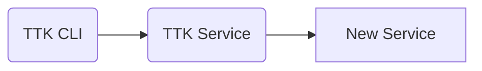

# Functional Testing using Mojaloop Testing Toolkit (TTK)

We can use TTK to perform functional tests on a new JSON based RestAPI service.



In this case, we need to run the new service with all its dependencies and execute TTK tests against it.

## Running functional tests

An example structure of the TTK files are provided in the directory `test/func`. Using docker-compose.yaml file provided in the folder, we can start the required services and execute the tests automatically.

Use the following command to execute sample functional tests against the example api service.

```
npm run test:func
```

You should see the `Passed percentage` as  `100%`

## Customization

You can provision your API specification and configure the TTK to execute functional tests.

- Include the openapi specification of the new service in TTK
  - Create a directory `Ex: new-dev-service` in the folder `spec_files/api_definitions` and place the new API definition in `api_spec.yaml`
  - In `system_config.json`, add it to the parameter `API_DEFINITIONS`
  - Remove the unnecessary API definitions from `spec_files/api_definitions` and `system_config.json`
- Configure TTK
  - Set the parameter `CALLBACK_ENDPOINT` in `user_config.json` to point to proper hostname and port of the new service.
- Run the new service and its dependencies in the background
- Run TTK service in the background
- Prepare a test case to test the required endpoints of the new service
- If you want to parameterize some values, prepare a TTK environment file
- Run the test case file with TTK CLI using the environment file
